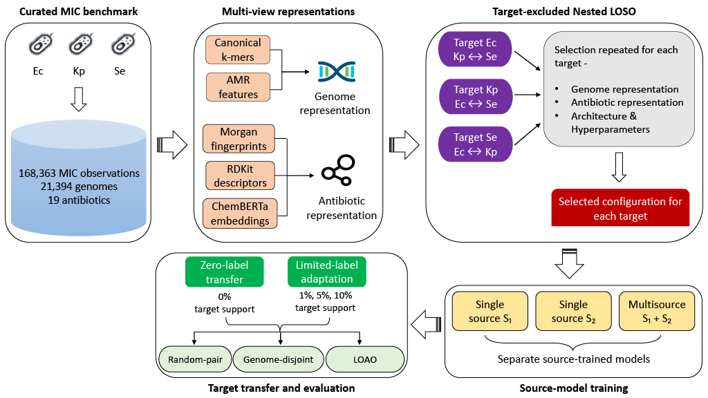
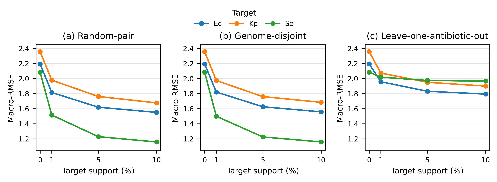

# Cross-Species Transferability of Multi-View Genome–Drug Models for Quantitative MIC Prediction

This repository contains the benchmark, model configurations, evaluation splits, code, and aggregate results used in our study of cross-species quantitative minimum inhibitory concentration (MIC) prediction.

The study includes three bacterial species:

- *Escherichia coli* (Ec)
- *Klebsiella pneumoniae* (Kp)
- *Salmonella enterica* (Se)

We study whether a genome–drug model trained on one or two source species can predict quantitative MIC values in a different target species.

We first evaluate **zero-target-label transfer**, where no MIC labels from the target species are used for training. We then evaluate **limited-label transfer** using nested 1%, 5%, and 10% target-support sets.

The models use two types of information:

- **Genome representations:** canonical k-mers and antimicrobial resistance (AMR) determinants
- **Antibiotic representations:** RDKit descriptors, Morgan fingerprints, and ChemBERTa embeddings

All drugs considered in this study are antibiotics.

## Study Workflow

[](results/figures/manuscript/study_workflow.pdf)

[](results/figures/manuscript/study_workflow.pdf)

The study has four main stages:

1. construct a curated quantitative MIC benchmark;
2. perform **target-excluded nested leave-one-species-out (LOSO) model selection**;
3. train two **single-source** models and one **balanced multisource** model for each target species;
4. evaluate zero-target-label transfer and limited-label adaptation under random-pair, genome-disjoint, and leave-one-antibiotic-out protocols.

The 1%, 5%, and 10% target-support sets are nested. Target-query labels are used only for final evaluation.

## Benchmark

The benchmark was constructed from the public [BV-BRC](https://www.bv-brc.org/) `genome_amr` collection and associated genome assemblies retrieved on 22 July 2026.

| Species | Genomes | MIC observations | Exact | Censored | Antibiotics |
| --- | ---: | ---: | ---: | ---: | ---: |
| *E. coli* | 6,673 | 68,881 | 25,742 | 43,139 | 19 |
| *K. pneumoniae* | 5,602 | 50,299 | 13,582 | 36,717 | 17 |
| *S. enterica* | 9,119 | 49,183 | 20,644 | 28,539 | 8 |
| **Total** | **21,394** | **168,363** | **59,968** | **108,395** | **19 unique** |

The benchmark contains **168,363 unique genome–antibiotic observations** from **21,394 quality-controlled and sequence-verified genomes** across a **19-antibiotic cross-species vocabulary**.

The benchmark is available as:

[`data/benchmark/final_quantitative_mic_benchmark_v1.tsv.gz`](data/benchmark/final_quantitative_mic_benchmark_v1.tsv.gz)

Definitions of all 62 columns are provided in:

[`docs/benchmark_schema.md`](docs/benchmark_schema.md)

### Main Curation Criteria

The benchmark retains:

- laboratory-reported, scalar, single-antibiotic MIC measurements;
- genomes with BV-BRC genome quality `Good`;
- CheckM completeness ≥95%;
- CheckM contamination ≤5%;
- no more than 500 contigs;
- N50 ≥20 kb;
- species–antibiotic cells with at least 500 genomes and at least 200 exact MIC observations;
- antibiotics with one reproducible connected molecular structure;
- genomes passing sequence-based species verification using [Kleborate](https://github.com/klebgenomics/Kleborate).

MIC values were harmonized to log₂ mg/L while retaining the original exact or censored measurement information.

Compatible repeated measurements for the same genome–antibiotic pair were reconciled into one observation. Conflicting repeated measurements were excluded.

The complete raw BV-BRC snapshot and genome assemblies are not redistributed. See [`docs/reproducibility.md`](docs/reproducibility.md) for details.

## Target-Excluded Nested LOSO Model Selection

Model selection was performed separately for each held-out target species.

For a target species, **none of its MIC outcome labels were used during model selection**. Candidate configurations were evaluated only by bidirectional transfer between the other two development species using their shared-antibiotic cohort.

| Held-out target | Development transfer | Shared-antibiotic cohort | Final source regimes |
| --- | --- | ---: | --- |
| Ec | Kp ↔ Se | 6 | Kp→Ec, Se→Ec, Kp+Se→Ec |
| Kp | Ec ↔ Se | 8 | Ec→Kp, Se→Kp, Ec+Se→Kp |
| Se | Ec ↔ Kp | 17 | Kp→Se, Ec→Se, Kp+Ec→Se |

The shared-antibiotic cohorts were used only for model selection. Final evaluation used the complete eligible antibiotic panel of each target species.

### Candidate Families

The model-selection procedure compared the following candidate families.

| Component | Candidate families |
| --- | --- |
| Genome representation | canonical 4–8-mer composition; common AMR determinants; input-level k-mer+AMR concatenation; projected and low-rank separate-encoder fusion |
| Antibiotic representation | RDKit descriptors; Morgan fingerprints; ChemBERTa embeddings; input-level and separate-encoder multi-view combinations |
| Genome–antibiotic architecture | additive effects; projection–concatenation MLP; dual-tower interaction; GMU; low-rank bilinear interaction; drug-to-genome FiLM |

The model-selection stages are described in [`docs/model_selection.md`](docs/model_selection.md).

### Selected Configurations

| Held-out target | Genome representation | Antibiotic representation | Architecture |
| --- | --- | --- | --- |
| Ec | 4-mer + common AMR with separate encoders and rank-8 low-rank fusion | RDKit descriptors | Drug-to-genome FiLM |
| Kp | Common AMR | ChemBERTa mean + Morgan + RDKit with input-level concatenation | Drug-to-genome FiLM |
| Se | Common AMR | ChemBERTa mean | Dual-tower interaction network |

Exact settings are provided in:

- [`config/final/outer_target_configurations.tsv`](config/final/outer_target_configurations.tsv)
- [`config/final/shared_hyperparameters.tsv`](config/final/shared_hyperparameters.tsv)
- [`results/model_selection/`](results/model_selection/)

## Cross-Species Transfer and Adaptation

For each target species, the selected configuration is trained under two **single-source** regimes and one **balanced multisource** regime using all eligible source antibiotics.

| Target | Source regimes |
| --- | --- |
| Ec | Kp→Ec, Se→Ec, Kp+Se→Ec |
| Kp | Ec→Kp, Se→Kp, Ec+Se→Kp |
| Se | Kp→Se, Ec→Se, Kp+Ec→Se |

At each balanced multisource optimization step, one cyclic batch is drawn from each source species and the species-specific losses are averaged. This prevents the larger source dataset from dominating training.

Three evaluation seeds, independent of model selection, are used. Source fold 5 selects the training epoch. The model is then reinitialized, its scalers are fitted on the complete source data, and it is retrained on all source observations for the selected number of epochs.

The resulting checkpoint is reused across target protocols and support settings.

## Zero-Target-Label Transfer

In **zero-target-label transfer**, the model is trained only on source-species observations and evaluated on the target species without using target MIC labels.

This corresponds to the **zero-shot transfer** setting used in the manuscript.

## Limited-Label Transfer

**Limited-label transfer** starts from the same source-trained model and adapts it using nested:

- 1% target support;
- 5% target support;
- 10% target support.

For each query, non-query observations are arranged in one deterministic antibiotic-balanced order. The 1%, 5%, and 10% target-support sets are nested prefixes of this ordering.

For each support antibiotic with at least two observations, a deterministic 20% subset is used for inner validation while keeping at least one observation for training.

Per-antibiotic macro-RMSE on this inner set selects up to 100 adaptation epochs with patience 12. The source checkpoint is then reloaded and adapted on the complete support set for the selected number of epochs.

Target-query labels are never used for adaptation-epoch selection.

## Evaluation Protocols

We use three target evaluation protocols.

### Random-Pair Evaluation

Random-pair evaluation divides each antibiotic's observations into five folds.

One fold is used as the query set and the remaining observations form the target-support pool. The same genome may appear in both query and support data, but the same observation cannot appear in both.

### Genome-Disjoint Evaluation

Genome-disjoint evaluation assigns all observations from the same genome to one fold. Genomes with identical canonical 8-mer profiles are also kept together.

Query genomes are therefore absent from the target-support set. This protocol tests transfer to unseen target genomes.

### Leave-One-Antibiotic-Out (LOAO) Evaluation

Leave-one-antibiotic-out evaluation uses all observations for one target antibiotic as the query set.

All remaining target antibiotics form the support pool. This protocol tests transfer when the query antibiotic has no target-species MIC labels in the support data.

## Target-Only Comparisons

Each adapted source-trained model is compared with a **target-only scratch baseline**.

The target-only scratch baseline uses the same architecture, target support, query set, seed, and inner validation split, but starts from random initialization and uses support-fitted scalers.

LOAO evaluation additionally includes a **target-only full-support reference** trained on all non-query target observations.

## Source-Shared and Source-Unseen Antibiotics

Results are also stratified according to whether the target antibiotic was represented in source MIC supervision.

- **Source-shared:** MIC supervision for the antibiotic is available in at least one source species.
- **Source-unseen:** the antibiotic is absent from source MIC supervision.

The six antibiotics shared across all three species form an additional matched comparison panel.

## Key Findings

The main findings are:

- Zero-target-label transfer is strongly direction-dependent.
- Increasing target support from 1% to 5% and 10% consistently improves performance.
- Source pretraining is most beneficial under severe target-label scarcity and for query antibiotics without target labels.
- Balanced multisource gains are clearest when the additional source species broadens antibiotic coverage.

[](results/figures/manuscript/multisource_adaptation_by_protocol.pdf)

The figure above shows balanced multisource performance at 0%, 1%, 5%, and 10% target support under random-pair, genome-disjoint, and LOAO evaluation.

## Metrics

The primary metric is **per-antibiotic macro-RMSE** on the log₂ MIC scale.

We also report:

- macro-MAE;
- R²;
- Pearson correlation;
- Spearman correlation;
- within-one-dilution accuracy, defined as absolute error ≤1 log₂ dilution.

| Evaluation | Uncertainty reporting |
| --- | --- |
| Zero-target-label full target panel | Mean ± sample SD across three model seeds |
| Random-pair and genome-disjoint | Metrics are first averaged across seeds within each fold, then summarized across five folds |
| Leave-one-antibiotic-out | Metrics are first averaged across seeds for each query antibiotic, then summarized across held-out antibiotics |

Paper-facing aggregate results are available in:

[`results/evaluation/`](results/evaluation/)

## Repository Layout

```text
config/final/             Final model configurations and hyperparameters
features/drug/            Antibiotic representations and row registry
features/genome_representation/
          Benchmark index, run plans, and split definitions
results/model_selection/  Target-excluded model-selection results
results/evaluation/       Paper-facing aggregate results
results/figures/manuscript/
                          Manuscript figures and plotted source data
scripts/                  Curation, training, adaptation, and aggregation
src/mic_transfer/         Models, preprocessing, and metrics
docs/                     Method and reproducibility documentation
```

The final observation and feature index is:

[`metadata/final_transfer/nested_loso_v1/splits_v1/final_transfer_observation_feature_index_v1.tsv.gz`](metadata/final_transfer/nested_loso_v1/splits_v1/final_transfer_observation_feature_index_v1.tsv.gz)

## Installation

Python 3.11 or newer is required.

Download and extract the repository, then open a terminal in the repository root.

```bash
python -m venv .venv
source .venv/bin/activate

python -m pip install --upgrade pip
python -m pip install -r requirements.txt
```

## Quick Verification

Run the standard verification with:

```bash
python scripts/verify_release.py
```

Run the full verification with:

```bash
python scripts/verify_release.py --full
```

The portable dependency file pins `torch==2.10.0`. The final experiments used `torch==2.10.0+cu130`.

See [`docs/computational_environment.md`](docs/computational_environment.md) for the recorded software and hardware environment.

## Running the Final Evaluation

Set the project root:

```bash
export MIC_TRANSFER_PROJECT="$(pwd)"
```

### Zero-Target-Label Source Training

```bash
python scripts/train_zero_target.py --device cuda
python scripts/aggregate_zero_target.py
```

### Random-Pair Adaptation

```bash
python scripts/adapt_random_pair.py --device cuda
python scripts/aggregate_random_pair.py
```

### Genome-Disjoint Adaptation

```bash
python scripts/adapt_genome_disjoint.py --device cuda
python scripts/aggregate_genome_disjoint.py
```

### Leave-One-Antibiotic-Out Adaptation

```bash
python scripts/adapt_antibiotic_held_out.py --device cuda
python scripts/aggregate_antibiotic_held_out.py
```

The adaptation stages require the source checkpoints produced by `train_zero_target.py`.

Use `--device cpu` if CUDA is unavailable. Use `--max-new-runs 1` for a small execution test.

See [`docs/execution_map.md`](docs/execution_map.md) for the inputs and outputs of each stage.

## Reproducibility

The released benchmark index, feature matrices, split definitions, model configurations, code, and aggregate tables support verification and rerunning of the final evaluation.

Full reconstruction from raw public resources additionally requires:

- BV-BRC records and genome assemblies;
- Kleborate;
- AMRFinderPlus;
- external molecular resources;
- regeneration of historical intermediate assets that are not distributed.

See:

- [`docs/reproducibility.md`](docs/reproducibility.md)
- [`docs/public_pipeline.md`](docs/public_pipeline.md)

## License and Citation

Repository code and documentation are released under the [MIT License](LICENSE).

Third-party data, software, models, and databases retain their original licenses.

A `CITATION.cff` file will be added after the manuscript metadata and persistent identifier are finalized. Until then, cite the corresponding manuscript and this repository.
