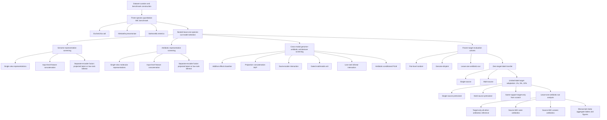

# Cross-Species Transferability of Multi-View Genome–Antibiotic Models for Quantitative MIC Prediction

This repository contains the frozen benchmark definitions, model configurations,
source/target run plans, evaluation code, molecular features, and aggregate results
for a three-species study of quantitative minimum inhibitory concentration (MIC)
prediction involving *Escherichia coli*, *Klebsiella pneumoniae*, and
*Salmonella enterica*.

The study asks whether a genome–antibiotic model trained on one or two bacterial
species can transfer to a held-out species with no labelled target-species MIC
observations, and how performance changes after limited-label target adaptation.

## Terminology

In this repository, a **view** is an alternative representation of the same
entity, whereas a **modality** identifies the two different model inputs:

- **Genome views:** canonical k-mer composition and common AMR determinants.
- **Antibiotic views:** RDKit descriptors, Morgan fingerprints, and frozen
  ChemBERTa embeddings.
- **Modalities:** the bacterial genome and the tested antibiotic.

## Study workflow



## Data source

The benchmark was derived from the public BV-BRC `genome_amr` collection and
associated BV-BRC genome records and assemblies. The frozen source snapshot was
retrieved on **22 July 2026** through the BV-BRC REST API using
`evidence = Laboratory Method`. Only laboratory-reported antimicrobial
susceptibility measurements linked to the selected bacterial genomes were
considered.

The original BV-BRC downloads and genome assemblies are not redistributed in
this repository. The released observation index contains the final benchmark
identifiers, harmonized quantitative targets, feature-row mappings, and frozen
split assignments.

## Benchmark construction

The benchmark was produced using the following frozen curation policy.

1. **Genome and record acquisition.** Laboratory-method AMR records were
   downloaded from BV-BRC, and the corresponding genome metadata and assemblies
   were obtained for candidate records.
2. **Assembly and metadata quality control.** Genomes were required to have
   BV-BRC genome quality `Good`, CheckM completeness at least 95%, CheckM
   contamination at most 5%, at most 500 contigs, and contig N50 at least
   20,000 bp. Taxonomic metadata and source-name consistency were also audited.
3. **Quantitative MIC parsing.** Measurements had to be positive scalar values
   in mg/L or μg/mL. The accepted signs were blank/`=`, `<`, `<=`, `>`, and `>=`;
   paired values such as `16/8`, records identified as disk-diffusion zone measurements rather than MIC, and unusable
   or unverified source-specific values were excluded. Antibiotic names were
   normalized, and explicit combination-drug identities were excluded from the
   monotherapy benchmark.
4. **Source and mapping audit.** Records with unreliable genome mappings or
   unsupported source/method combinations were removed using frozen,
   source-specific adjudication rules.
5. **Repeated-observation reconciliation.** Repeated records for the same
   species–genome–antibiotic combination were represented as MIC constraints.
   Compatible records were collapsed through interval intersection; combinations
   with an empty intersection were excluded. The final benchmark contains at
   most one quantitative observation per genome–antibiotic pair.
6. **Censoring-aware point-target policy.** Original censoring status was
   retained in the released index. Exact and inclusive bounds (`<=`, `>=`) were
   represented at the reported threshold. Strict `<` values were represented
   one twofold dilution below the threshold, and strict `>` values one twofold
   dilution above it. The resulting positive mg/L target was transformed to
   log₂ MIC.
7. **Molecular eligibility.** Antibiotic identities were linked to an
   authoritative single-structure registry before molecular features were
   generated.
8. **Sequence-based species verification.** Candidate *E. coli*,
   *K. pneumoniae*, and *S. enterica* assemblies were checked with the Kleborate
   Enterobacterales species module. Only strong calls concordant with the target
   species were retained. This excluded 14 provisional *E. coli* genomes and 70
   provisional *K. pneumoniae* genomes; no *S. enterica* genome was excluded at
   this stage.

## Final benchmark

| Species | Genomes | MIC observations | Exact | Censored | Antibiotics |
|---|---:|---:|---:|---:|---:|
| *E. coli* | 6,673 | 68,881 | 25,742 | 43,139 | 19 |
| *K. pneumoniae* | 5,602 | 50,299 | 13,582 | 36,717 | 17 |
| *S. enterica* | 9,119 | 49,183 | 20,644 | 28,539 | 8 |
| **Total** | **21,394** | **168,363** | **59,968** | **108,395** | — |

<details>
<summary><strong>Final antibiotic panels</strong></summary>

**E. coli (19):** amikacin, ampicillin, aztreonam, cefepime, cefmetazole,
cefotaxime, cefoxitin, ceftazidime, ceftriaxone, cefuroxime, chloramphenicol,
ciprofloxacin, imipenem, levofloxacin, meropenem, minocycline, tetracycline,
tigecycline, and tobramycin.

**K. pneumoniae (17):** amikacin, aztreonam, cefepime, cefmetazole,
cefotaxime, cefoxitin, ceftazidime, ceftriaxone, cefuroxime, ciprofloxacin,
imipenem, levofloxacin, meropenem, minocycline, tetracycline, tigecycline, and
tobramycin.

**S. enterica (8):** ampicillin, cefoxitin, ceftazidime, ceftriaxone,
chloramphenicol, ciprofloxacin, meropenem, and tetracycline.

</details>

## Representations compared

Model selection was staged rather than a simultaneous full-factorial search.
For every outer target, candidate choices were compared without using MIC labels
from that target species.

### Genome representations

The genome screen compared:

1. **Canonical k-mer composition only.** Canonical reverse-complement-collapsed
   relative-frequency vectors were screened for k = 4, 5, 6, 7, and 8. The
   target-excluded screens selected 4-mer, 5-mer, and 6-mer representations for
   the outer *E. coli*, *K. pneumoniae*, and *S. enterica* loops,
   respectively.
2. **Common AMR view only.** Binary genome-level presence of transferable AMR
   determinants derived separately for each outer loop using only its two
   development species. A determinant had to occur in both development species,
   in at least five genomes per species, and have pooled prevalence no greater
   than 0.99. Copy multiplicity was ignored.
3. **Input-level k-mer + AMR concatenation.** Raw k-mer and AMR features were
   concatenated before one genome encoder.
4. **Projected latent concatenation.** K-mer and AMR views used separate
   encoders, followed by concatenation of their projected latent vectors.
5. **Factorized low-rank bilinear genome-view fusion.** Separate k-mer and AMR
   encoders were coupled by a low-rank bilinear interaction in addition to the
   projected latent base.

### Antibiotic representations

The antibiotic screen compared:

1. **RDKit descriptors:** a frozen 27-descriptor physicochemical vector.
2. **Morgan fingerprint:** radius 2, 2,048 bits, with chirality.
3. **ChemBERTa mean embedding:** a 384-dimensional frozen embedding obtained by
   mean-pooling attention-valid non-special tokens.
4. **ChemBERTa first-token embedding:** a 384-dimensional pooling ablation.
5. **Two-view input-level concatenation:** ChemBERTa mean + Morgan.
6. **Three-view input-level concatenation:** ChemBERTa mean + Morgan + RDKit.
7. **Projected latent multi-view fusion:** separate molecular-view encoders
   followed by latent concatenation for the two-view and three-view bundles.
8. **Factorized low-rank bilinear molecular-view fusion:** separate
   molecular-view encoders with a rank-16 bilinear interaction for the two-view
   and three-view bundles.

Continuous molecular views were scaled using training-partition statistics;
the Morgan view remained binary. The ChemBERTa encoder was frozen.

### Genome–antibiotic architectures

With the selected genome and antibiotic representations fixed, the cross-modal
screen compared:

- a separable additive genome–antibiotic effects baseline;
- a projection–concatenation multilayer perceptron;
- a dual-tower interaction network;
- a cross-modal gated multimodal unit (GMU);
- a factorized low-rank bilinear interaction model; and
- drug-to-genome feature-wise linear modulation (FiLM).

## Target-excluded nested leave-one-species-out selection

For each outer target species, all of its MIC outcome labels were excluded from
representation, architecture, and hyperparameter selection. Candidates were
ranked by bidirectional transfer between the other two development species using
all eligible observations from their pairwise shared-antibiotic cohort. The
selected configuration was then frozen, reinitialized, and trained under each
prescribed source regime before evaluation on the held-out target.

| Held-out outer target | Development transfer used for selection | Shared antibiotics used only for inner selection | Final transfer regimes |
|---|---|---:|---|
| *E. coli* | *K. pneumoniae* ↔ *S. enterica* | 6 | KP→EC, SE→EC, KP+SE→EC |
| *K. pneumoniae* | *E. coli* ↔ *S. enterica* | 8 | EC→KP, SE→KP, EC+SE→KP |
| *S. enterica* | *K. pneumoniae* ↔ *E. coli* | 17 | KP→SE, EC→SE, KP+EC→SE |

The pairwise shared cohorts above were used only for target-excluded model
selection. Final held-out evaluation used each target species' complete eligible
antibiotic panel.

## Frozen final configurations

| Held-out target | Genome representation | Antibiotic representation | Cross-modal architecture |
|---|---|---|---|
| *E. coli* | Separate selected 4-mer and common-AMR encoders with rank-8 factorized low-rank bilinear genome-view fusion | RDKit descriptors | Drug-to-genome FiLM |
| *K. pneumoniae* | Common-AMR binary view | Input-level concatenation of ChemBERTa mean, Morgan, and RDKit views | Drug-to-genome FiLM |
| *S. enterica* | Common-AMR binary view | ChemBERTa mean embedding | Dual-tower interaction network |

The exact target-excluded numerical settings are stored in
`config/final/shared_hyperparameters.tsv`; the complete frozen configurations are
stored in `config/final/outer_target_configurations.tsv`.

## Final evaluation

The final study includes:

- **zero-target-label transfer:** source-only training with no labelled MIC
  observation from the held-out target species;
- **single-source and multi-source limited-label adaptation:** full-model
  adaptation with nested 1%, 5%, and 10% target-support sets;
- **same-support target-only from-scratch baseline:** the same frozen
  outer-target architecture trained from random initialization using exactly the
  target labels available to the corresponding adapted model;
- **pair-level random split:** target observations are partitioned into five
  folds; support and query may contain different antibiotic records from the
  same genome;
- **genome-disjoint evaluation:** every observation from a genome group is kept
  in one of five folds, so query genomes do not occur in target support;
- **leave-one-antibiotic-out evaluation:** every target observation for one
  antibiotic is held out, while target support contains only the other
  antibiotics;
- **target-only all-other-antibiotics reference:** a target-only model trained on
  the complete non-query support pool for leave-one-antibiotic-out evaluation;
- **source MIC-supervision familiarity analysis:** held-out antibiotics are
  labelled source-seen or source-unseen according to whether they appeared in
  the source-species MIC training data.

“Zero-target-label” refers specifically to the absence of labelled target-species
MIC observations during source training. It does not imply that an antibiotic or
related chemical structure was absent from external molecular pretraining.

## Metrics and uncertainty

The primary metric is per-antibiotic macro-RMSE on the log₂ MIC scale. The
repository also reports macro-MAE, R², Pearson correlation, Spearman correlation,
and within-one-dilution accuracy (1-tier accuracy), defined as the proportion of
predictions within ±1 log₂ dilution of the harmonized evaluation target.

Uncertainty was summarized as follows:

- **Zero-target-label full-panel results:** mean ± sample standard deviation
  across three model seeds.
- **Pair-level random and genome-disjoint results:** the three seeds were first
  averaged within each target fold, followed by mean ± sample standard deviation
  across the five fold-level values.
- **Leave-one-antibiotic-out results:** the three seeds were first averaged
  within each held-out antibiotic, followed by mean ± sample standard deviation
  across held-out antibiotics.

## Repository contents

```text
config/                  Frozen target-excluded configurations and hyperparameters
data/                    Data-access and reconstruction notes
features/drug/           Released molecular feature matrices and row registry
features/genome_representation/
                         Three final selected genome feature matrices
metadata/                Final benchmark index, run plans, query/support memberships, and split registries
results/model_selection/ Aggregate target-excluded model-selection evidence
results/evaluation/      Aggregate held-out target results
scripts/                 Final training, adaptation, and aggregation entry points
src/mic_transfer/        Reusable model architectures, preprocessing, and metric code
```

The observation-level benchmark is released as:

```text
metadata/final_transfer/nested_loso_v1/splits_v1/
final_transfer_observation_feature_index_v1.tsv.gz
```

It contains the species, BV-BRC genome identifier, normalized antibiotic,
harmonized log₂ MIC target, exact/censored indicator, feature-row mappings,
duplicate-profile group, and frozen random-pair and genome-disjoint fold
assignments for all 168,363 final observations.

The nested support and query memberships used in the paper are released in the
same directory. The final molecular matrices and their row registry are included
under `features/drug/`.

## Installation

Clone the repository, create an isolated environment, and install the portable
pinned dependencies:

```bash
git clone https://github.com/Arghyasree/multispecies-mic-transfer.git
cd multispecies-mic-transfer
python -m venv .venv
source .venv/bin/activate
python -m pip install --upgrade pip
python -m pip install -r requirements.txt
```

`requirements.txt` uses the platform-neutral PyTorch version. The exact GPU
environment used for the paper, including `torch==2.10.0+cu130`, is preserved in
`requirements-frozen.txt` and documented in
[`docs/computational_environment.md`](docs/computational_environment.md).
Install a PyTorch build compatible with the local CPU/GPU platform when the
frozen CUDA wheel is unavailable.

## Quick verification

Before running training:

```bash
python scripts/verify_release.py
```

After installing the complete environment, also run the model smoke test:

```bash
python scripts/verify_release.py --full
```

Both commands are read-only with respect to the released benchmark and result
tables.

## Reproducibility scope

The included benchmark index, selected genome and antibiotic matrices, split
memberships, configurations, run plans, code, and aggregate tables are
sufficient to validate and rerun the **frozen final evaluation**. Raw BV-BRC
downloads, assemblies, discarded candidate matrices, checkpoints, and per-run
training histories are not distributed. Reconstructing the full raw-data and
model-selection pipeline requires the external resources described in
[`docs/reproducibility.md`](docs/reproducibility.md).

## Reproducing the final evaluation

Set the project root and verify the release:

```bash
export MIC_TRANSFER_PROJECT="$(pwd)"
python scripts/verify_release.py --full
```

Then run the final stages in order:

```bash
python scripts/train_zero_target.py --device cuda
python scripts/aggregate_zero_target.py
python scripts/adapt_random_pair.py --device cuda
python scripts/aggregate_random_pair.py
python scripts/adapt_genome_disjoint.py --device cuda
python scripts/aggregate_genome_disjoint.py
python scripts/adapt_antibiotic_held_out.py --device cuda
python scripts/aggregate_antibiotic_held_out.py
```

The adaptation stages require the source checkpoints produced by
`train_zero_target.py`. On a machine without CUDA, use `--device cpu`; full runs
will be substantially slower. Use `--max-new-runs 1` and the target/seed filters
shown by `python <script> --help` for a small execution test.

The three selected genome matrices are included under
`features/genome_representation/`; final molecular matrices are included under
`features/drug/`. See [`docs/execution_map.md`](docs/execution_map.md) for the
stage-by-stage inputs and outputs.

## Results

Paper-facing aggregate results are available under `results/evaluation/`.
Detailed frozen aggregate tables are retained under
`results/tables/final_transfer/nested_loso_v1/`. Model-selection rankings are
available under `results/model_selection/`.

Figures are intentionally omitted until the manuscript figure set and captions
are finalized.

## License

The original software and documentation in this repository are released under
the MIT License; see `LICENSE`.

The MIT License does not relicense BV-BRC records or genome assemblies, the
ChemBERTa checkpoint, RDKit, Kleborate, AMRFinderPlus, or any other third-party
resource. Those materials remain subject to their respective licenses and terms
of use.

## Citation

A `CITATION.cff` file will be added when the manuscript title, author list,
venue, and persistent identifier are finalized. Until then, please cite the
corresponding manuscript and this repository URL.

## Public reproducibility pipeline

The conceptual workflow above is mapped to the existing repository layout in
[`docs/execution_map.md`](docs/execution_map.md). The current physical folder
structure is retained because the frozen scripts and registries use those
repository-relative paths.
